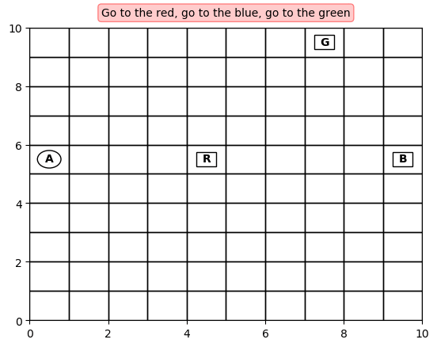
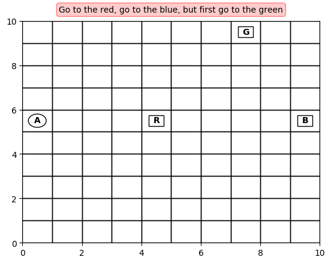

# Task-Oriented Language Grounding for Language Input with Multiple Sub-Goals of Non-Linear Order

This repository contains an accompanying source code and experiments' results for [this paper](https://arxiv.org/abs/1910.12354).





## How the project is organized

Folder ```experiments``` contains the code for different agents. It's built around 5 main python files:
- ```parameters.py``` contains definitions for the model: hyperparameters, seed, definition of the environment/insturctions dataset/layouts, and etc.
- ```train.py``` contains logic for training the agent. The training is assumed to be started by calling ```start_training```. All the parameters are taken from ```parameters.py```
- ```visualize.py``` contains logic for visualising the agent. All the parameters are taken from ```parameters.py```
- ```evaluation.py``` contains logic for evaluating the agent. All the parameters are taken from ```parameters.py```
- ```model.py``` contains the model of the network. All the parameters are taken from ```parameters.py```
------

In order to train, evaluate, or visualise any of the agents, you need to import the target function/module. Few examples: 

- To visualise the Dueling DQN + Gated-Attention agent
```
from experiments.dueling_dqn_ga import visualize
```
- To start training of the Dueling DQN + Concatenation agent
```
from experiments.dueling_dqn_cat import train
train.start_training()
```
- To benchmark the Dueling DQN + Concatenation agent
```
from experiments.dueling_dqn_cat import evaluate
evaluate.benchmark_all()
```
------

Every experiment is saved into its own folder, which is defined in terms of the parameters in ```parameters.py```. All the training data (tensorboard logs), benchmarks (```benchmarks.json```), and the best model (```best.model```) are inside of it.

------

If you want to run many experiments with different parameters, consider the file ```runner_hypothesis_synonyms.py```. It shows how you could do it (but it's a bit messy).

------
It's recommended to use Linux-based system, as the most Windows systems are not friendly with long paths. 

------
Just execute ```build_run.sh```, and it will build a container for running training or benchmarking jobs (visualiztion should be run locally).
